# Loop coordinates prediction model

## 1. Coordinates and models
**window** - sliding window, predict the coordinate in the centre of the window.

**directional / bidirectional** - recurrent neural networks.

**straight** - predict each coordinate.

**difference** - predict differences between neighbour coordinates

**window + straight** - predict each coordinate.

### 1.1. Naive approach

Surround sequences by null symbols.

### 1.2. "Omega loops"

First and last amino acids depends on each other other. It is better than the naive approach:


### 1.3 Positional / length-positional

Add position or position/length for each amino acid to each dense layer. It helps:

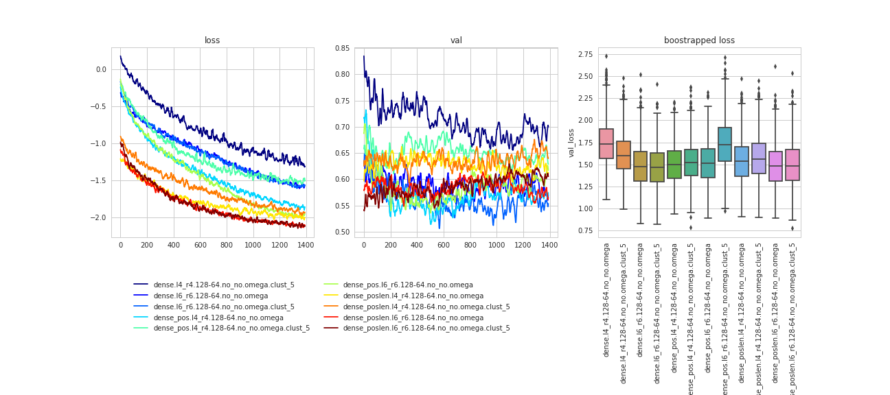

Interstinegly enough, if we train the model on CDRs and predict putative ones than the pos-len modification helps a lot:

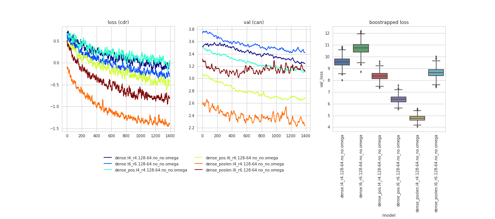

### 1.4. Recurrent models

GRU models, 1500 iterations:
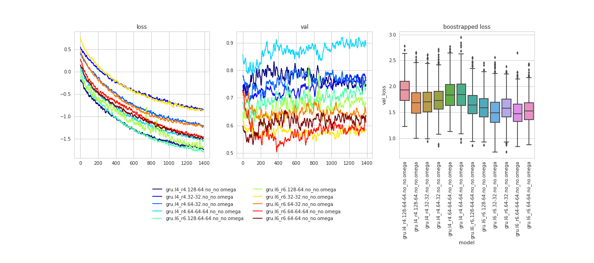

### 1.5. Convolutional models

GRU models, 1500 iterations:
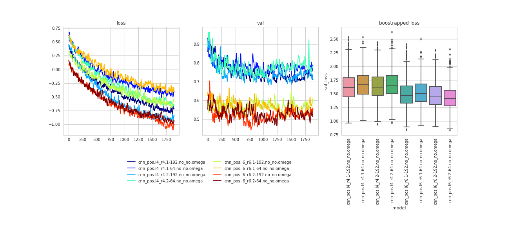

### 1.6. Difference among coordinates (left-to-right / right-ot-left directions)

#### Naive prediction

Due to the iterative nature the error is aggreageted through the sequence.

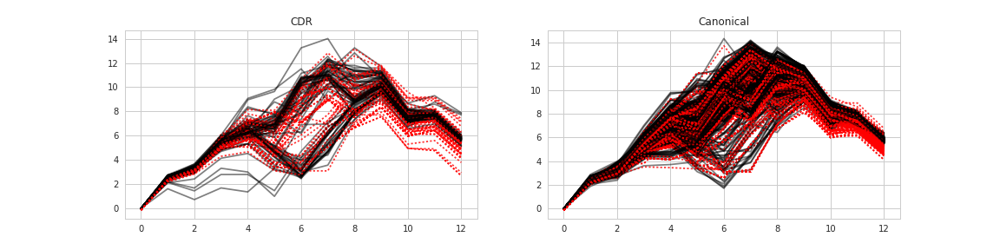


#### 1.6.2. Ensembling

Ensemble the predicted coordinates with `Bayesian Ridge`. Cross validation score (negative MSE): 

```
array([-0.0673693 , -0.1109571 , -0.39486038, -0.09391625, -0.02850241,
       -0.13117736, -0.10696883, -0.18005811, -0.13272101, -0.20850138])
```

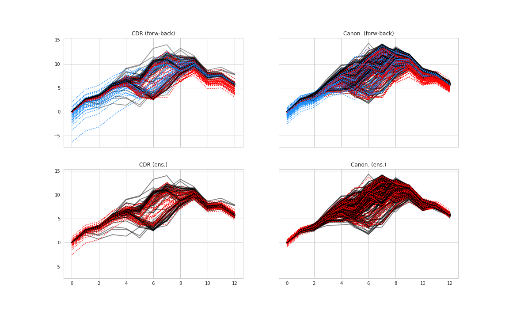


## 2. Amino acid transformations
**one-hot** - code each amino acid as a 20-dimensional vector with 1 at the index of the corresponding amino acid.

**kidera** - worked worse than one-hot.

**embeddings** - ??? (infer embeddings on the overall dataю)

**two-hot** - one-hot vector + one-hot vector for target amino acid.


## 3. Feature preprocessing

### 3.1. Scale the data

Scale the data to [0,1]. Tested on models with [128,64] dense layers, 4-4 window size, 2000 iterations.
- per column - scale each column independently:
```
MSE:
no scale:
    cdr - 1.61775   ***
    can - 0.0993797
MinMax:
    cdr - 2.43089   *
    can - 0.0978544
MaxAbs:
    cdr - 1.95208   **
    can - 0.0967865
```
- overall - scale the overall matrix:
```
no scale:
    cdr - 1.61775   ***
    can - 0.0993797
MinMax:
    cdr - 2.27693   *
    can - 0.105339
MaxAbs:
    cdr - 1.96837   **
    can - 0.0973526
```

### 3.2. Pre-clustering

Assign weights accroding to the clusters' sizes. Cluster weight = `ln(cluster size) / ln(minimal cluster size)`. Clustering helps:

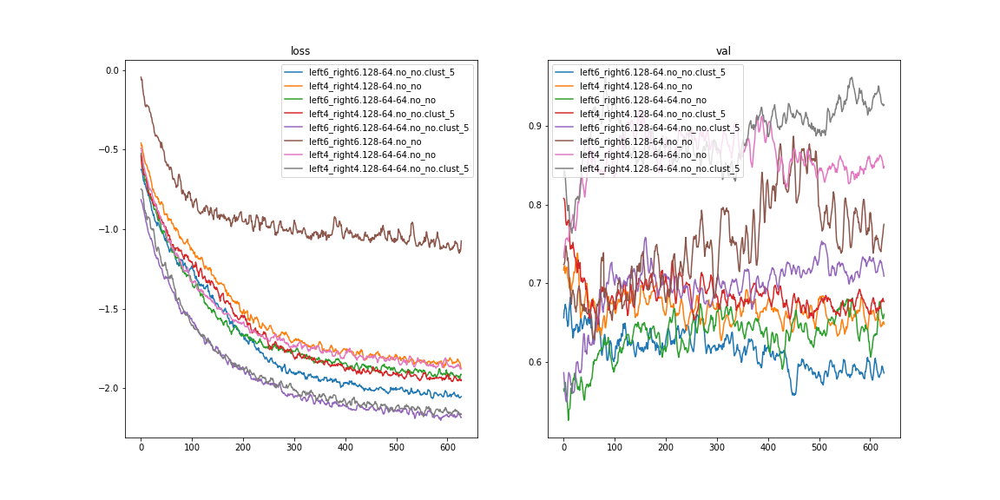

However prediction with clustering is a little bit off due to the small weights on big clusters:

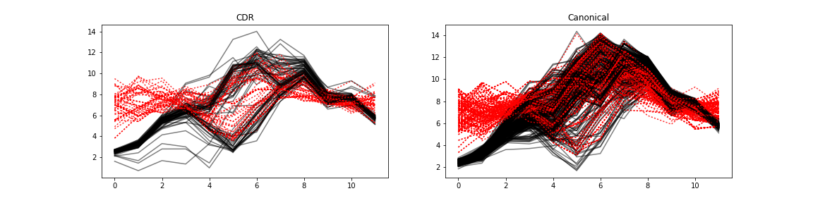


### 3.3. Pre-clustering with fading weights on clusters

???
???


## 4. Learning

### 4.1. Straightforward learning

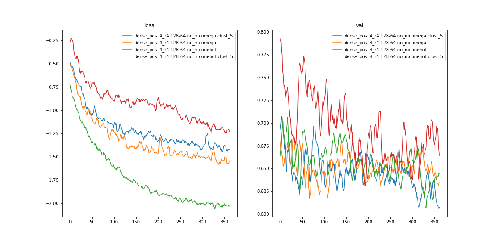


### 4.2. Change learning rate

Factor 0.3, patience 3
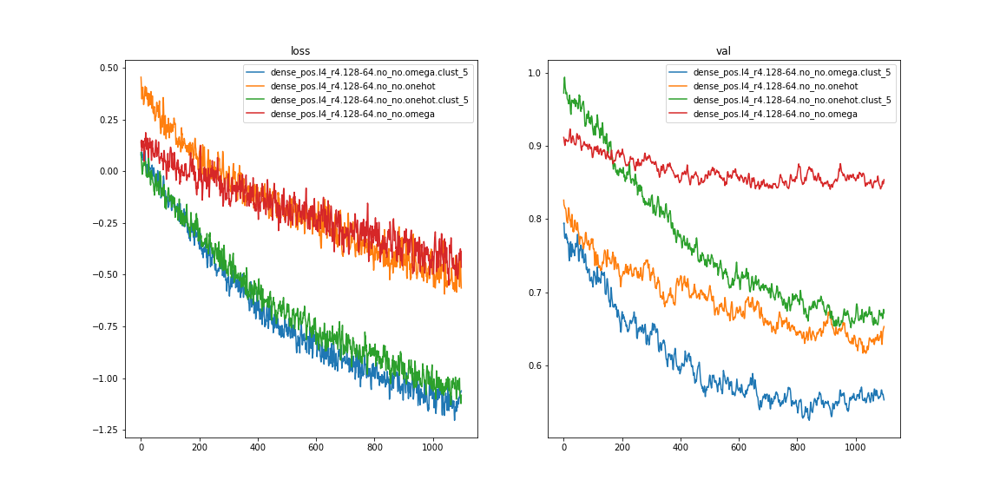

Factor 0.1, patience 3
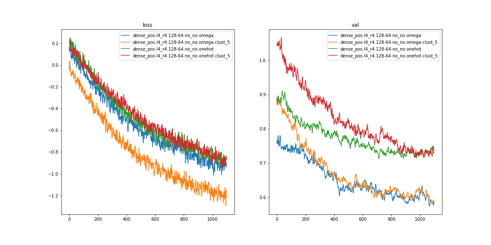

Factor 0.1, patience 6
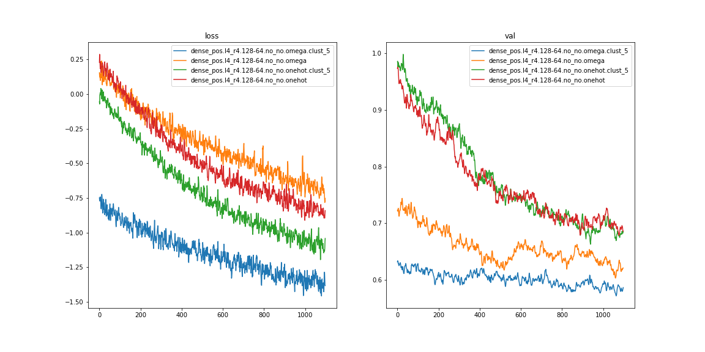


### 4.3. Add putative sequences to batches

??? (to add noise)


## 5. Post-analysis

### 5.1. Ensembling

???